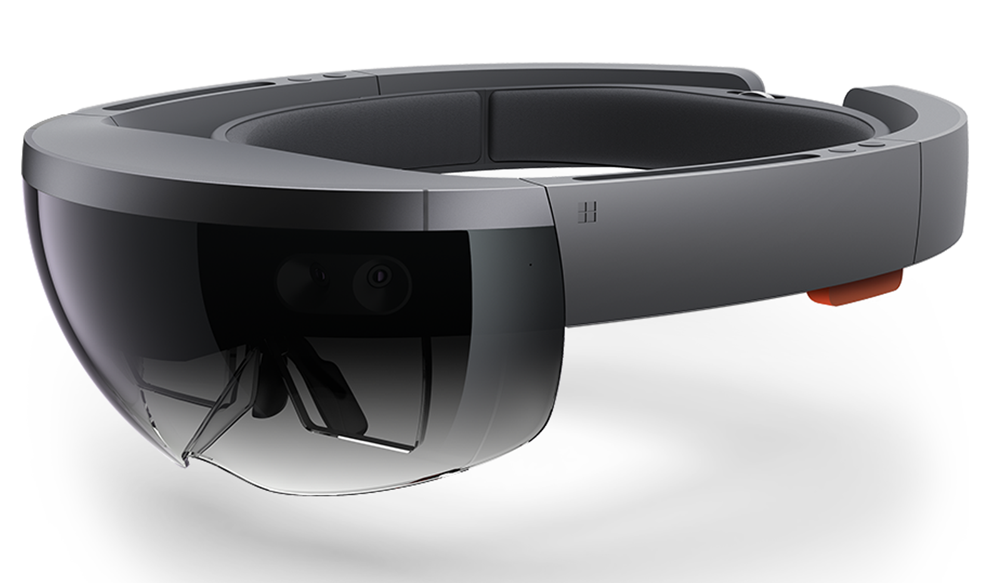

<h1><strong>Skilling Module 2 | Introduction to Mixed Reality using Unity</strong></h1>

Tutor: Octavian Gheorghiu

<h1><strong>Overview and purpose</strong></h1>

The class aims to introduce students to mixed reality development using the Unity game engine as a tool for design exploration and design communication. At the end of the class the students will build an app that showcases a hologram they have developed and the interaction with the hologram object.

<h1><strong>Education Standards</strong></h1>
<ol>
<li>Inspire, motivate and challenge students</li>
<li>Make productive use of assessments</li>
<li>Adapt classes to respond to strengths and needs of students</li>
</ol>
<h1><strong>Objectives</strong></h1>
<ol>
<li>Learn the necessary skills required to write and execute code</li>
<li>Learn the necessary skills to produce an app or a video game</li>
</ol>
<h1><strong>Materials Needed</strong></h1>
<ol>
<li>Unity Game Engine, Version 2019.x</li>
<li>Visual Studio Community 2019</li>
</ol>
<h1><strong>Verification</strong></h1>
<ol>
<li>All the objectives subcategories will be assessed by a small exercise that will require the students to use the newly learned skill</li>
<li>Skills development will require previous understanding of learned skills to proceed, thus showcasing when a necessary skill has yet to be learned</li>
<li>The final exercise will require the usage of most of the learned skills</li>
</ol>
<h1><strong>Lesson Plan</strong></h1>

Five sessions totaling 12 hours:

<ol>
<li>Session 1: Introduction to Mixed Reality and Tools Setup</li>
<ol>
<li>What is mixed reality?</li>
<li>Setting up the tools</li>
<li>Configuring Unity and Visual Studio</li>
<li>Deploying the HoloLens emulator</li>
<li>Deploying to the HoloLens device</li>
</ol>
<li>Session 2: Basic Interaction</li>
<ol>
<li>Gaze</li>
<li>Gestures</li>
<li>Speech</li>
</ol>
<li>Session 3: Shared experiences</li>
<ol>
<li>How shared holograms work</li>
<li>Setting up the server</li>
<li>Syncing data</li>
</ol>
<li>Session 4: Project example</li>
<ol>
<li>Using all the interaction modes on a hologram</li>
<li>Setting up custom shaders for holograms</li>
<li>Importing animations and setting up simple physics interaction</li>
<li>Building and deploying a final app</li>
</ol>
</ol>
<h1><strong>Homework assignments</strong></h1>
<ol>
<li>Session 1 homework:</li>
<ol>
<li>Setup the tools and send a save a screenshot of the emulator working</li>
</ol>
<li>Session 2 homework:</li>
<ol>
<li>Setup a simple gaze interaction</li>
<li>Setup a simple gesture interaction</li>
<li>Setup a simple voice command interaction</li>
</ol>
<li>Session 3 homework:</li>
<ol>
<li>Create an animated cube, setup the server, deploy the app to multiple devices and save screenshot of cube from multiple vantage points</li>
</ol>
<li>Session 4 homework:</li>
<ol>
<li>Deploy the example app and save a screenshot</li>
</ol>
</ol>
<h1><strong>Final assignment</strong></h1>

Modify the Unity example, deploy the HoloLens device and save videos of the following:

<ol>
<li>Your own hologram object and animation</li>
<li>Interaction with your hologram object using at least one interaction method</li>
<li>Shared experience screenshots</li>
</ol>
<h1><strong>Online support tutorials</strong></h1>
<ul>
<li>GitHub repo setup for the skilling module: https://goo.gl/cb9cxL</li>
<li>C# for Unity: <a href="https://goo.gl/dJsHf6">https://goo.gl/dJsHf6</a></li>
<li>App Development for Microsoft HoloLens: https://goo.gl/4QUMJV</li>
<li>Holograms 101E: https://goo.gl/KJ4ZUF</li>
<li>Holograms 240: https://goo.gl/QCofVB</li>
</ul>
<h1><strong>Grading</strong></h1>
<ul>
<li>Class Participation &acirc;&euro;&ldquo; 30%</li>
<li>Class Homework &acirc;&euro;&ldquo; 70%</li>
</ul>
<h1><strong>Plagiarism</strong></h1>

UCL takes plagiarism very seriously and regards it as a form of fraud. The definition of plagiarism that has been adopted by the School of Continuing and Professional Studies is as follows: "Plagiarism is presenting someone else's work as though it were one's own. More specifically, plagiarism is to present as one's own words quoted without quotation marks from another writer; a paraphrased passage from another writer&acirc;&euro;&trade;s work; or facts or ideas gathered, organized, and reported by someone else, orally and/or in writing. Since plagiarism is a matter of fact, not of the student's intention, it is crucial that acknowledgement of the sources be accurate and complete. Even where there is not a conscious intention to deceive, the failure to make appropriate acknowledgement constitutes plagiarism. Penalties for plagiarism range from failure for a paper or course to dismissal from the University.

<h1><strong>Instructor</strong></h1>

Reuse and building upon ideas or code are major parts of modern software development. As a professional programmer you will never write anything from scratch. This class is structured such that all solutions are public. You are encouraged to learn from the work of your peers. I won't hunt down people who are simply copying-and-pasting solutions, because without challenging themselves, they are simply wasting their time and money taking this class.

Please respect the terms of use and/or license of any code you find, and if you reimplement or duplicate an algorithm or code from elsewhere, credit the original source with an inline comment.

